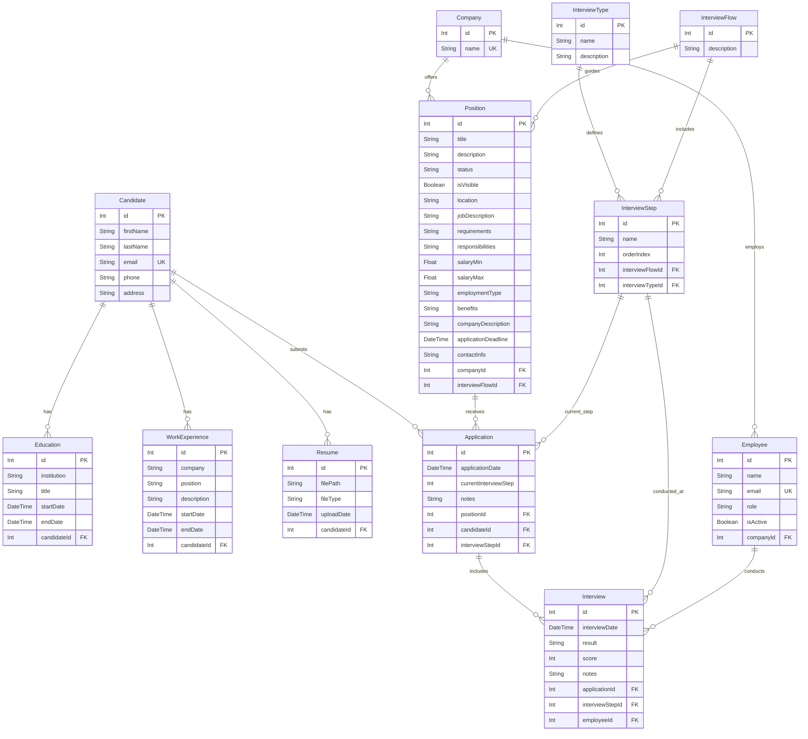

# Data Model Documentation

This document describes the data model for the LTI (Learning Tracking Initiative) application, including entity descriptions, field definitions, relationships, and an entity-relationship diagram.

## Model Descriptions

### 1. Candidate
Represents a job candidate who can apply for positions within the system.

**Fields:**
- `id`: Unique identifier for the candidate (Primary Key)
- `firstName`: Candidate's first name (max 100 characters)
- `lastName`: Candidate's last name (max 100 characters)
- `email`: Candidate's unique email address (max 255 characters)
- `phone`: Candidate's phone number (optional, max 15 characters)
- `address`: Candidate's address (optional, max 100 characters)

**Validation Rules:**
- First name and last name are required, 2-100 characters, letters only
- Email is required, must be unique, and follow valid email format
- Phone is optional but must follow Spanish format (6|7|9)XXXXXXXX if provided
- Address is optional but cannot exceed 100 characters
- Maximum of 3 education records per candidate

**Relationships:**
- `educations`: One-to-many relationship with Education model
- `workExperiences`: One-to-many relationship with WorkExperience model
- `resumes`: One-to-many relationship with Resume model
- `applications`: One-to-many relationship with Application model

### 2. Education
Represents educational background information for candidates.

**Fields:**
- `id`: Unique identifier for the education record (Primary Key)
- `institution`: Name of the educational institution (max 100 characters)
- `title`: Degree or certification title obtained (max 250 characters)
- `startDate`: Start date of the education period
- `endDate`: End date of the education period (optional, null if ongoing)
- `candidateId`: Foreign key referencing the Candidate

**Validation Rules:**
- Institution is required and cannot exceed 100 characters
- Title is required and cannot exceed 250 characters
- Start date is required and must be in valid date format
- End date is optional but must be valid if provided
- Maximum of 3 education records per candidate

**Relationships:**
- `candidate`: Many-to-one relationship with Candidate model

### 3. WorkExperience
Represents work history and professional experience for candidates.

**Fields:**
- `id`: Unique identifier for the work experience record (Primary Key)
- `company`: Name of the company or organization (max 100 characters)
- `position`: Job title or position held (max 100 characters)
- `description`: Description of responsibilities and achievements (optional, max 200 characters)
- `startDate`: Start date of the work experience
- `endDate`: End date of the work experience (optional, null if current)
- `candidateId`: Foreign key referencing the Candidate

**Validation Rules:**
- Company name is required and cannot exceed 100 characters
- Position is required and cannot exceed 100 characters
- Description is optional but cannot exceed 200 characters if provided
- Start date is required and must be in valid date format
- End date is optional but must be valid if provided

**Relationships:**
- `candidate`: Many-to-one relationship with Candidate model

### 4. Resume
Represents uploaded resume files associated with candidates.

**Fields:**
- `id`: Unique identifier for the resume record (Primary Key)
- `filePath`: File system path to the uploaded resume (max 500 characters)
- `fileType`: MIME type or file extension of the resume (max 50 characters)
- `uploadDate`: Date and time when the resume was uploaded
- `candidateId`: Foreign key referencing the Candidate

**Validation Rules:**
- File path is required and cannot exceed 500 characters
- File type is required and cannot exceed 50 characters
- Upload date is automatically set when file is uploaded
- Supported file types: PDF and DOCX (max 10MB)

**Relationships:**
- `candidate`: Many-to-one relationship with Candidate model

### 5. Company
Represents companies that post job positions and employ staff.

**Fields:**
- `id`: Unique identifier for the company (Primary Key)
- `name`: Unique company name

**Relationships:**
- `employees`: One-to-many relationship with Employee model
- `positions`: One-to-many relationship with Position model

### 6. Employee
Represents employees within companies who can conduct interviews.

**Fields:**
- `id`: Unique identifier for the employee (Primary Key)
- `name`: Employee's full name
- `email`: Employee's unique email address
- `role`: Employee's role or job title
- `isActive`: Boolean indicating if the employee is currently active
- `companyId`: Foreign key referencing the Company

**Relationships:**
- `company`: Many-to-one relationship with Company model
- `interviews`: One-to-many relationship with Interview model

### 7. InterviewType
Defines different types of interviews that can be conducted.

**Fields:**
- `id`: Unique identifier for the interview type (Primary Key)
- `name`: Name of the interview type (e.g., "Technical", "HR", "Behavioral")
- `description`: Detailed description of the interview type (optional)

**Relationships:**
- `interviewSteps`: One-to-many relationship with InterviewStep model

### 8. InterviewFlow
Represents a sequence of interview steps that define the hiring process.

**Fields:**
- `id`: Unique identifier for the interview flow (Primary Key)
- `description`: Description of the interview flow process (optional)

**Relationships:**
- `interviewSteps`: One-to-many relationship with InterviewStep model
- `positions`: One-to-many relationship with Position model

### 9. InterviewStep
Represents individual steps within an interview flow.

**Fields:**
- `id`: Unique identifier for the interview step (Primary Key)
- `name`: Name of the interview step
- `orderIndex`: Numeric order of this step within the flow
- `interviewFlowId`: Foreign key referencing the InterviewFlow
- `interviewTypeId`: Foreign key referencing the InterviewType

**Relationships:**
- `interviewFlow`: Many-to-one relationship with InterviewFlow model
- `interviewType`: Many-to-one relationship with InterviewType model
- `applications`: One-to-many relationship with Application model
- `interviews`: One-to-many relationship with Interview model

### 10. Position
Represents job positions available for application.

**Fields:**
- `id`: Unique identifier for the position (Primary Key)
- `companyId`: Foreign key referencing the Company (required)
- `interviewFlowId`: Foreign key referencing the InterviewFlow (required)
- `title`: Job title (required, max 100 characters)
- `description`: Brief description of the position (required)
- `status`: Current status of the position (default: "Draft", valid values: Open, Contratado, Cerrado, Borrador)
- `isVisible`: Boolean indicating if the position is publicly visible (default: false)
- `location`: Job location (required)
- `jobDescription`: Detailed job description (required)
- `requirements`: Job requirements and qualifications (optional)
- `responsibilities`: Job responsibilities (optional)
- `salaryMin`: Minimum salary range (optional, must be >= 0)
- `salaryMax`: Maximum salary range (optional, must be >= 0 and >= salaryMin)
- `employmentType`: Type of employment (e.g., "Full-time", "Part-time", "Contract") (optional)
- `benefits`: Job benefits description (optional)
- `companyDescription`: Description of the hiring company (optional)
- `applicationDeadline`: Deadline for applications (optional, must be a future date)
- `contactInfo`: Contact information for inquiries (optional)

**Validation Rules:**
- Title is required and cannot exceed 100 characters
- Description, location, and jobDescription are required fields
- Status must be one of: Open, Contratado, Cerrado, Borrador
- Company and interview flow references must exist in the database
- Salary values must be non-negative numbers
- Application deadline must be a future date if provided

**Relationships:**
- `company`: Many-to-one relationship with Company model
- `interviewFlow`: Many-to-one relationship with InterviewFlow model
- `applications`: One-to-many relationship with Application model

### 11. Application
Represents a candidate's application to a specific position.

**Fields:**
- `id`: Unique identifier for the application (Primary Key)
- `applicationDate`: Date when the application was submitted
- `currentInterviewStep`: Current step in the interview process
- `notes`: Additional notes about the application (optional)
- `positionId`: Foreign key referencing the Position
- `candidateId`: Foreign key referencing the Candidate
- `interviewStepId`: Foreign key referencing the current InterviewStep

**Relationships:**
- `position`: Many-to-one relationship with Position model
- `candidate`: Many-to-one relationship with Candidate model
- `interviewStep`: Many-to-one relationship with InterviewStep model
- `interviews`: One-to-many relationship with Interview model

### 12. Interview
Represents individual interview sessions conducted as part of an application.

**Fields:**
- `id`: Unique identifier for the interview (Primary Key)
- `interviewDate`: Date and time of the interview
- `result`: Interview result or outcome (optional)
- `score`: Numeric score or rating from the interview (optional)
- `notes`: Interview notes and feedback (optional)
- `applicationId`: Foreign key referencing the Application
- `interviewStepId`: Foreign key referencing the InterviewStep
- `employeeId`: Foreign key referencing the conducting Employee

**Relationships:**
- `application`: Many-to-one relationship with Application model
- `interviewStep`: Many-to-one relationship with InterviewStep model
- `employee`: Many-to-one relationship with Employee model

## Entity Relationship Diagram

## Key Design Principles

1. **Referential Integrity**: All foreign key relationships ensure data consistency across the system.

2. **Flexibility**: The interview flow system allows for customizable hiring processes per position.

3. **Audit Trail**: Application and interview dates provide a complete timeline of the hiring process.

4. **Extensibility**: The modular design allows for easy addition of new features and data points.

5. **Data Normalization**: The model follows database normalization principles to minimize redundancy and ensure data integrity.

## Notes

- All `id` fields serve as primary keys with auto-increment functionality
- Foreign key relationships maintain referential integrity
- Optional fields allow for flexible data entry while maintaining required core information
- The interview system supports multi-step hiring processes with different types of interviews
- Email fields have unique constraints to prevent duplicate accounts 